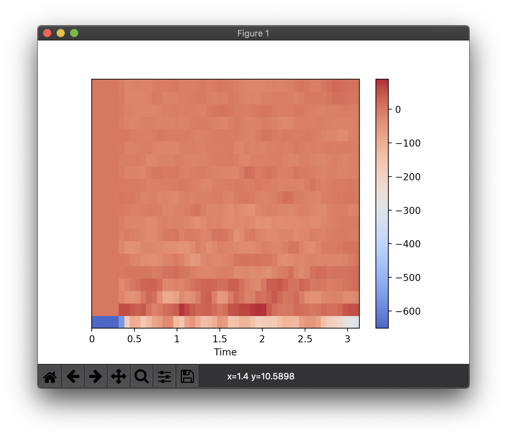

# voice similarity

音声の類似度を算出



## 処理の流れ
- 比較対象となる２つの音声を用意
- 音声をリサイズ・リサンプリング（可変長の音声を調整するため）
- 音声をMFCC（メル周波数ケプストラム係数）に変換
- それぞれのMFCCの決定係数を類似度とする


## 実行環境
- MacOS 10.15.3
- Python 3.7.5


## 使用方法
### APIの起動
```sh
$ python api.py
```

## インストール
```sh
$ git clone https://github.com/AjxLab/rcc_winter_hackathon_2020
$ cd rcc_winter_hackathon_2020
$ pip install -r lib/requiremenst.txt
```
